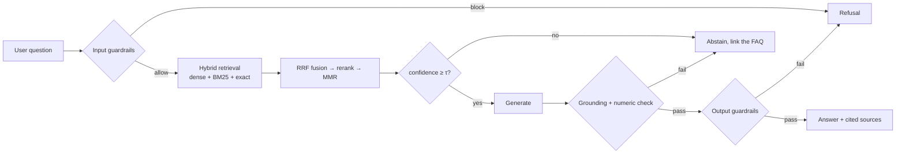

# tng-faq-rag-system-1

A grounded, guardrailed **Retrieval-Augmented Generation** system that answers
questions about the Touch 'n Go eWallet using **only verified TNG Digital FAQ
content**, and refuses everything else — out-of-scope questions, prompt
injection, PII requests and illicit instructions.

> **This is a rebuild of an earlier project of mine**,
> [`purplingC/faq-rag-system`](https://github.com/purplingC/faq-rag-system).
> The first version worked but had defects that only showed up under
> measurement — scores normalised in a way that made abstention unreachable, an
> echo detector that discarded every correct answer, and moderation applied to
> the knowledge base itself. This version is a ground-up rewrite that fixes
> them, proves each fix with a regression test, and records the evidence in
> [docs/original-issues.md](docs/original-issues.md).

```python
from tngd_faq_rag import ask_tngd_bot

ask_tngd_bot("What is TNG eWallet SOS Balance?")
```

**Zero runtime dependencies.** The default pipeline is implemented against the
Python standard library, so a fresh clone answers questions offline, with no
model download and no `pip install`. Every heavyweight backend
(sentence-transformers, FAISS, transformers, an LLM API) is optional, detected
at runtime, and upgrades the system in place.

| | |
| --- | --- |
| Retrieval (seed corpus) | recall@1 **0.962** · recall@4 **1.000** · MRR **0.981** |
| Out-of-scope questions refused | **13 / 13** |
| Adversarial prompts blocked | **23 / 23**, correct category 23/23, English and Malay |
| Ordinary support questions wrongly blocked | **0 / 18** golden set, **0 / 4,452** real FAQ questions |
| Verified answers ever suppressed | **0** |
| Latency | **2–5 ms** per question, single-threaded, no GPU |
| Tests | **322** passing, none touching the network |

---

## Quick start

Two ways to run it. **Docker needs nothing but Docker.** The Python path needs
Python 3.9 or newer.

### Option A — Docker (recommended for reviewers)

**1. Get the code.** In a terminal:

```bash
git clone https://github.com/purplingC/tng-faq-rag-system-1.git
```

```bash
cd tng-faq-rag-system-1
```

**2. Start Docker Desktop** and wait until it says it is running. Commands fail
with `Cannot connect to the Docker daemon` until then.

**3. Build and run:**

```bash
docker compose up --build
```

The first build takes a few minutes; later runs start in seconds. The image
carries the FAQ and a pre-built index, so no scraping, no API key, no setup.

**4. Wait for this line:**

```
INFO  tngd_faq_rag | API ready: ... docs=2477, chunks=2668
```

**5. Open <http://127.0.0.1:8080/docs>**, expand `POST /v1/ask`, click **Try it
out**, then **Execute**. Or from a second terminal:

```bash
curl -X POST http://127.0.0.1:8080/v1/ask -H "Content-Type: application/json" -d '{"question":"What is TNG eWallet SOS Balance?"}'
```

**6. Stop it** with `Ctrl+C`, then optionally remove the container:

```bash
docker compose down
```

### Option B — Python

**1. Get the code:**

```bash
git clone https://github.com/purplingC/tng-faq-rag-system-1.git
```

```bash
cd tng-faq-rag-system-1
```

**2. Create a virtualenv** (most systems refuse a system-wide install):

```bash
python3 -m venv .venv
```

```bash
source .venv/bin/activate          # Windows: .venv\Scripts\activate
```

Your prompt now starts with `(.venv)`. Repeat this step in every new terminal.

**3. Install:**

```bash
pip install -e ".[api]"            # drop [api] if you only want the CLI
```

**4. Run it.** This builds the index from the 2,477 scraped articles in about
three seconds, answers a scripted set of questions, then opens a chat prompt:

```bash
tngd-faq-rag
```

Type a question, or `exit` to quit.

**5. Anything else you want to try:**

```bash
tngd-faq-rag ask "What is TNG eWallet SOS Balance?"     # one question
tngd-faq-rag ask "Explain SOS balance" --json           # full response data
tngd-faq-rag ui                                         # web chat on http://127.0.0.1:8000
tngd-faq-rag-api                                        # REST API on http://127.0.0.1:8080/docs
TNGD_ANSWERABILITY=off tngd-faq-rag eval                # golden-set scores
tngd-faq-rag smoke                                      # fast end-to-end check
tngd-faq-rag --help                                     # everything
```

**6. When finished:**

```bash
deactivate
```

### The same things through `make`

`make` creates the virtualenv for you, so no activation step:

```bash
make install-dev               # venv + package + pytest/ruff/mypy
make run                       # demo, then chat
make api                       # REST API
make ui                        # web chat
make test                      # 322 tests
make check                     # lint + types + tests + eval (what CI runs)
make help                      # every target
```

### Optional: better refusals with a free Gemini key

Without a key the system still works; it just can't catch questions that are on
topic but unanswerable. With one:

```bash
cp .env.example .env
```

Put your key from <https://aistudio.google.com/apikey> on the `LLM_API_KEY=`
line, then confirm it works:

```bash
tngd-faq-rag info              # look for "reachable": true
```

### If something goes wrong

| Message | Fix |
| --- | --- |
| `Cannot connect to the Docker daemon` | Docker Desktop is not running. Open it, wait, retry |
| `error: externally-managed-environment` | Create the virtualenv in step 2 |
| `command not found: tngd-faq-rag` | Activate the virtualenv: `source .venv/bin/activate` |
| `Address already in use` | Something else holds the port: `TNGD_API_PORT=8090 tngd-faq-rag-api` |
| Answers look stale after changing the FAQ | Rebuild the index: `tngd-faq-rag index --rebuild` |

---

## Do I need a virtualenv?

**Yes — use one.** Not because this project has dependencies to isolate (it has
none at runtime), but because:

1. **`pip install -e .` writes a `tngd-faq-rag` console script.** Without a venv that
   lands in your system or user Python, where it collides with other projects and
   is awkward to remove. Modern Python installs (Homebrew, Debian/Ubuntu, Fedora)
   actively refuse a system-wide `pip install` with
   `error: externally-managed-environment` — so a venv is the only supported path
   on most machines anyway.
2. **The optional extras are large and pinned.** `[ml]` pulls torch,
   transformers, FAISS and sentence-transformers — roughly 2.5 GB with strong
   version constraints. That belongs in a disposable directory.
3. **Reproducibility.** `.venv` is gitignored, so `rm -rf .venv && make install`
   returns you to a known-good state, and CI runs the same command you do.

Create it once:

```bash
python3 -m venv .venv
source .venv/bin/activate          # Windows: .venv\Scripts\activate
pip install -e ".[dev]"
```

Or through the Makefile, which creates the virtualenv for you:

```bash
make install-dev                   # or: make install     (core only)
                                   # or: make install-ml  (~2.5 GB)
```

**Which extra do I want?**

| Command | Installs | Use when |
| --- | --- | --- |
| `pip install -e .` | nothing extra | You just want to run it |
| `pip install -e ".[fast]"` | NumPy | Larger corpora; faster vector maths |
| `pip install -e ".[api]"` | FastAPI, uvicorn (~27 MB) | You want the REST service |
| `pip install -e ".[dev]"` | pytest, ruff, mypy | You are developing or reviewing |
| `pip install -e ".[ml]"` | torch, transformers, FAISS, sentence-transformers | You want real dense embeddings, cross-encoder reranking or local generation |

Deactivate with `deactivate`. Start over with `make distclean`.

**If you would rather not use a venv at all**, the package still runs straight
from the source tree with no installation:

```bash
PYTHONPATH=src python3 -m tngd_faq_rag ask "What is CardMatch?"
```

---

## Project structure

```
tng-faq-rag-system-1/
├── README.md                    ← you are here
├── pyproject.toml               packaging, extras, ruff/mypy/pytest config
├── Makefile                     make help
├── .env.example                 every environment variable, documented
├── .github/workflows/ci.yml     tests on 3.9–3.13 + a bare-interpreter job
│
├── src/tngd_faq_rag/
│   ├── __init__.py              public surface: ask_tngd_bot
│   ├── __main__.py              python -m tngd_faq_rag
│   ├── cli.py                   subcommands
│   ├── config.py                all tunables, env overrides, index fingerprint
│   ├── constants.py             endpoints, canned copy, index filenames
│   ├── deps.py                  optional dependency probing (without importing)
│   ├── models.py                shared dataclasses
│   ├── text.py                  normalisation, tokenisation, HTML→text
│   ├── ingestion.py             load, coerce, validate, deduplicate
│   ├── chunking.py              structure-aware chunking
│   ├── embeddings.py            hashed TF-IDF │ sentence-transformers
│   ├── indexes.py               vector index (FAISS│NumPy│pure) + Okapi BM25
│   ├── store.py                 SQLite, thread-local connections
│   ├── retrieval.py             hybrid retrieval, RRF fusion, MMR
│   ├── reranking.py             absolute-relevance rerankers
│   ├── llm.py                   OpenAI-compatible chat client (stdlib only)
│   ├── env.py                   .env loader (stdlib only)
│   ├── language.py              guesses Malay or English from the question
│   ├── events.py                optional JSONL event log, redacted
│   ├── guardrails/              input policy, injection, answerability, grounding
│   ├── generation/              extractive │ local seq2seq │ OpenAI-compatible
│   ├── pipeline.py              orchestration, persistence, ask_tngd_bot
│   ├── scraper.py               Zendesk Help Centre harvesting
│   ├── web/                     stdlib chat UI (human-facing demo)
│   ├── api/                     FastAPI service (machine-facing, optional)
│   ├── evaluation.py            metrics harness
│   ├── golden_set.py            the 95 evaluation cases
│   └── resources/               packaged seed knowledge base, 30 English + 29 Malay
│
├── data/tngd_faq.json           full scraped FAQ, 2,477 articles
├── data/tngd_faq_ms.json        Malay, 1,975 articles, answered from
├── data/tngd_faq_zh.json        Chinese, 10 articles (stored, not used)
├── tests/                       322 tests, no network access
├── Dockerfile  .dockerignore  docker-compose.yml
└── docs/
│   ├── architecture.md          diagrams, module map, design rules
│   ├── api.md                   endpoints, auth, design decisions
│   ├── chunking.md              strategy and rationale
│   ├── retrieval.md             fusion, calibration, known failure modes
│   ├── guardrails.md            threat model and the six layers
│   ├── evaluation.md            methodology and results
│   └── original-issues.md       what was wrong before, and the proof
```

---

## The required interface

```python
from tngd_faq_rag import ask_tngd_bot

response = ask_tngd_bot("What is TNG eWallet SOS Balance?")
```

Always returns a JSON-serialisable `dict` containing the four specified keys:

```json
{
  "question": "What is TNG eWallet SOS Balance?",
  "retrieved_chunks": [{ "chunk_id": "...", "scores": {...}, "...": "..." }],
  "final_answer": "SOS Balance is an exclusive feature ...",
  "blocked": false
}
```

plus a strict superset, safe to ignore:

| Key | Meaning |
| --- | --- |
| `url` | Source URL for the answer — always the article the answer came from |
| `sources` | Ranked list with `relevance`, `category` and a `cited` flag |
| `decision` | Which branch produced the answer (see below) |
| `confidence` | Calibrated `[0, 1]` retrieval confidence |
| `safety` | Input verdict, output verdict, grounding score, per-sentence citations |
| `backends` | Which embedder / index / reranker / generator were used |
| `latency_ms`, `trace` | Timing and the ordered pipeline stages |

**Decision codes**

| Code | Meaning |
| --- | --- |
| `exact_faq` | Verbatim or near-verbatim FAQ question |
| `high_confidence_faq` | One dominant source, answered from its text |
| `extractive` | Composed from verified source sentences |
| `generated` | Abstractive, grounded and cited |
| `abstain_low_confidence` | Below the confidence threshold |
| `abstain_unanswerable` | An LLM judged that no retrieved passage answers the question |
| `abstain_ungrounded` | Generation was not supported by the sources |
| `blocked_input` / `blocked_output` | A guardrail refused |
| `empty_question` | Nothing to answer |

---

## How it works



**Chunking** — atomic by default (one FAQ entry, one chunk), paragraph-then-
sentence packing for long answers, a contextual `Q:` header on every chunk so
part 3 of 5 still knows its topic, and parent linking so the answer is always
drawn from the complete verified article. → [docs/chunking.md](docs/chunking.md)

**Retrieval** — dense + BM25 + exact/fuzzy question match, fused with Reciprocal
Rank Fusion, reranked to an **absolute** `[0, 1]` relevance and diversified with
MMR. Scores are never normalised across candidates, which is what makes the
abstention threshold reachable. → [docs/retrieval.md](docs/retrieval.md)

**Guardrails** — five layers, intent-scoped rather than keyword-based, with
obfuscation normalisation, Luhn-validated card detection, a grounding gate that
checks every asserted number, and an output policy that never touches trusted
corpus text. → [docs/guardrails.md](docs/guardrails.md)

**Generation** — defaults to an extractive composer that assembles answers from
verified source sentences, so it *cannot* hallucinate and needs no model. An
answer is served whole when the user asked the FAQ question itself or when it
fits the answer budget (6 sentences, 1,200 characters). Only longer answers are
trimmed to the matching sentences, keeping an *It* or *This* sentence with the
one it refers back to, and a cut answer says so and points to the source link.
Optional local or API backends plug in behind the same grounding gate.

---

## Knowledge base

The repository ships the **full public FAQ**. `data/tngd_faq.json` holds 2,477
articles across 253 categories, scraped from the TNG eWallet help centre on
2026-09-17, in the schema the assignment specifies — `question`, `answer`,
`url`, `category`. A fresh clone answers from it with no network and no scrape.

A 30-entry seed corpus (`src/tngd_faq_rag/resources/tngd_faq_seed.json`) ships
inside the package too, with 29 of those articles in Malay
(`tngd_faq_seed_ms.json`) so the evaluation scores both languages offline. The tests and `tngd-faq-rag eval` always use it, so their
numbers stay reproducible while the live site changes, and it is the fallback
when `data/tngd_faq.json` is absent.

**Malay is answered too.** `data/tngd_faq_ms.json` holds 1,975 Malay articles,
1,955 of which are translations of an English one. A Malay question is answered
from the Malay corpus, in Malay.

Each language keeps its **own index**. Merging the two corpora would change the
English term statistics, and with them every threshold measured against English,
so they stay separate and the question picks one. Measured:

| | |
| --- | --- |
| Malay golden set | recall@1 **1.000**, refusals **6/7** without an LLM key, 7/7 with |
| Language guessed correctly | English **99.96%** (2,476/2,477), Malay **98.99%** (1,955/1,975) |
| Malay retrieval, asking an article's own question | recall@1 **0.987** on a 150-article sample |
| Real questions wrongly blocked | **0** of 4,452, both languages |

When a Malay question finds nothing, the English corpus is tried as a fallback,
since many answers exist only there. Set `TNGD_LANGUAGES=en` to load English only.

`data/tngd_faq_zh.json` holds the 10 Chinese articles the site has. It is stored
but **not used**: the tokenizer matches `a-z0-9`, so it reads no Chinese at all.

To re-scrape from the live site:

```bash
tngd-faq-rag scrape            # all articles → data/tngd_faq.json + .csv
tngd-faq-rag scrape --locale ms-my    # Malay, or zh-my for Chinese, or all
tngd-faq-rag scrape --limit 100    # a smaller sample
```

The scraper uses the Zendesk Help Center JSON API that the site exposes, rather
than parsing rendered HTML: the payload is stable, paginated, and carries the
canonical URL and section name for every article. Each table row becomes one
labelled sentence, such as *"Loan amount: RM10,000 - RM150,000."*, so a single
row can be quoted instead of the whole table running together. It backs off on
failure and sleeps between requests. Output is picked up automatically on the
next run.

### Vector DB files

The index is **generated, not committed** — `.tngd_index/` holds the SQLite
metadata store, the float32 vectors and the BM25 postings. Rebuild it any time:

```bash
tngd-faq-rag index --rebuild    # or: make index
```

It rebuilds in about a second for the seed corpus and about three seconds for the
full 2,477-article FAQ. Rebuilds are automatic whenever the knowledge base, the
chunking settings or the analysis vocabulary change — the manifest stores a
content hash and a config fingerprint.

---

## Optional: the REST API

`pip install -e ".[api]"` adds a FastAPI service alongside the CLI and the demo
UI — all three share one pipeline.

```bash
make api                     # http://127.0.0.1:8080/docs

curl -X POST http://127.0.0.1:8080/v1/ask \
  -H 'Content-Type: application/json' \
  -d '{"question": "What is TNG eWallet SOS Balance?"}'
```

Typed request/response contracts, generated OpenAPI docs, `X-API-Key` auth, rate
limiting, separate liveness and readiness probes, request-ID correlation and
structured JSON access logs. The pipeline runs in a worker thread so a
synchronous call never blocks the event loop.

```bash
docker compose up --build    # or: make docker-run
```

Details and the reasoning behind each decision: **[docs/api.md](docs/api.md)**.

## Optional: the answerability gate

Everything above works with no LLM. One class of failure, however, cannot be
fixed by better retrieval:

```
"How do we spell SOS balance?"   0.4189   <- unanswerable from the article
"Explain SOS Balance"            0.4196   <- perfectly answerable
```

Both retrieve the same correct article, because to a term-overlap scorer they
**are** the same query: same subject, same salient terms, same best match. No
threshold separates 0.4189 from 0.4196. Telling them apart requires judging
whether a passage *answers* a question, which is what language models are good
at and term statistics are not — the **CRAG / Self-RAG** pattern.

Point the system at any OpenAI-compatible endpoint and the gate turns itself on:

Create a key at <https://aistudio.google.com/apikey>, then put it in `.env`:

```bash
cp .env.example .env    # then edit the Gemini block
```

```ini
# .env  - gitignored, never committed
LLM_API_BASE=https://generativelanguage.googleapis.com/v1beta/openai
LLM_MODEL=gemini-3.5-flash-lite
LLM_API_KEY=AIza...
TNGD_GENERATOR=extractive        # grade only; answers stay verbatim from the FAQ
```

`.env` is read automatically at startup. A variable already exported in your
shell always wins over the file, so a stale `.env` can never quietly override
something you just set.

`GEMINI_API_KEY` and `GOOGLE_API_KEY` work too — Google's own setup docs tell you
to export those, and a key found in either selects the Gemini endpoint
automatically, so `LLM_API_BASE` becomes optional.

```bash
tngd-faq-rag info                 # confirms the key actually works
tngd-faq-rag ask "How do we spell SOS balance?"   # -> abstain_unanswerable
```

Verify before debugging anything else — the gate **fails open**, so a bad key
produces no visible symptom at all, just silently degraded quality. `info`
reports `"reachable": true/false` and the exact error.

Grading adds roughly 900 ms to an answered question (a network round-trip) and
costs one API call. Three kinds of question never reach it and stay at
single-digit milliseconds: blocked ones, abstained ones, and **exact FAQ
matches** — when the user asked a catalogued question word for word, there is no
ambiguity for a model to resolve. A high score alone does not skip it: on the full
FAQ, *"Can I use my eWallet overseas?"* scored 0.72 against *"Can I use my card
overseas?"*, and grading it moved the answer to the correct *"What is Overseas QR
Payment?"* article. Always run the evaluation with it off — it
fires 30–40 calls in a burst, past the free tier's 15 requests/minute, and the
golden-set numbers are meant to be reproducible offline:

```bash
TNGD_ANSWERABILITY=off tngd-faq-rag eval
```

Free options, honestly compared:

| | Setup | Judgement | Latency | Offline |
| --- | --- | --- | --- | --- |
| **Gemini** (AI Studio) | a key, nothing installed | best | ~300–900 ms network | no |
| **Ollama** (local) | ~2 GB download, ~3 GB RAM | adequate for a YES/NO call | ~50–150 ms on Apple silicon | **yes** |
| **Groq** | a key | good | fast | no |

Gemini is the lightest and the most accurate; Ollama is the only one that keeps
the system fully offline and quota-free. Hosted free tiers and model names change
— check current terms before relying on one.

Three properties worth knowing:

* **It fails open.** An unreachable endpoint degrades quality, never availability
  — this is an extra gate on a pipeline that is already safe without it. Every
  response records a `graded` flag so a silent fallback is visible in the trace.
* **It runs last**, after the cheap filters, so the model only ever sees
  plausible candidates. Results are cached per (question, passages).
* **It narrows what the generator sees** to the passages the grader endorsed —
  corrective RAG, not just a yes/no gate.

## Optional: the event log

Off by default. Set a path and the system appends one JSON line per question:

```bash
TNGD_EVENT_LOG=logs/events.jsonl tngd-faq-rag ask "What is CardMatch?"
```

```json
{"ts":"2026-09-23T15:24:31+0800","question":"What is CardMatch?","language":"en",
 "decision":"exact_faq","blocked":false,"confidence":1.0,"latency_ms":47.5,
 "answer_chars":412,"source_url":"https://support.tngdigital.com.my/...",
 "llm_called":false,"llm_model":"","llm_ms":null}
```

Read it back without any other tool:

```bash
tngd-faq-rag stats --log logs/events.jsonl
```

That prints counts by decision and language, how many questions cost an LLM call,
median and worst latency, and **the questions that got no answer** — which is the
list of gaps in the FAQ.

Two deliberate choices:

* **Card numbers, emails and phone numbers are redacted before the line is written.**
  Support questions contain them. A card number is only redacted when it passes the
  Luhn check, so a plain reference number stays readable.
* **The API key is never written, in any form.** The log records which *model* answered
  (`llm_model`), because that is what you would actually need to know.

Writing a line can never break a request: any failure is swallowed and logged at debug
level. Rotation and retention are left to the host, since a container's logs are usually
collected by the platform.

## Configuration

Everything is environment-driven with working defaults; see
[.env.example](.env.example) for the full list.

```bash
export TNGD_ABSTAIN_THRESHOLD=0.45   # be more or less willing to answer
export TNGD_ANSWERABILITY=off        # force the gate off even with an LLM set
```

---

## Development

```bash
make install-dev
make test          # 322 tests
make lint          # ruff
make typecheck     # mypy, clean
make check         # everything CI runs
pytest -m network  # opt in to the live-scraper test
```

CI runs on Python 3.9–3.13 across Linux, macOS and Windows, and includes a job
that installs with `--no-deps` on a bare interpreter — that job is what proves
the zero-dependency claim rather than merely asserting it.

---

## Limitations

* **The zero-dependency embedder matches words, not meanings.** It handles FAQ
  paraphrase well, but *"renew road tax for more than one car"* loses to an
  insurance article because the incidental word "car" gives more token overlap.
  Installing `sentence-transformers` replaces it transparently.
* **The extractive generator cannot synthesise across two articles.** That is a
  deliberate accuracy/safety trade: it cannot hallucinate, but it also cannot
  combine two FAQs into one answer. Set `LLM_API_KEY` for abstractive answers —
  the grounding gate still applies.
* **Guardrails are rule-based.** English and Malay patterns cover the highest-risk
  categories — injection, illicit requests and other people's data — and both were
  checked against every real FAQ question for false positives. A fine-tuned safety
  classifier would still raise recall on novel paraphrased attacks.
* **Malay safety copy has not been reviewed by a native speaker.** Refusals and
  abstentions follow the question's language, and the crisis helpline numbers are
  unchanged, but the Malay wording should be checked before this is used publicly.
* **Mixed Malay and English questions are fragile.** Malaysians write both at once.
  *"teach me how to use sos balance"* is answered, while *"**ajar** me how to use sos
  balance"* is refused: the one unknown word changes which articles rank first. And
  *"boleh tak I check my sos balance"* is answered **in Malay**, because the language
  vote picks one language for a question written in two.
* **Chinese is not supported.** The site has 10 Chinese articles, and the tokenizer
  cannot read Chinese characters. It would need character n-gram tokenising.
* **Malay grounding is not separately measured.** Retrieval and abstention now have
  a Malay golden set (recall@1 1.000, refusals 6/7 without an LLM key), but grounding
  is assumed to behave as it does in English rather than proven to.
* **No conversational memory.** Each question is answered independently;
  multi-turn would need query rewriting plus re-screening of the rewritten query.
* **The golden set is 95 cases** — enough for regression, not for statistically
  strong claims. Reranker weights were tuned on 26 of them; the optimum is a
  broad plateau rather than a knife-edge, but it is still a dev set.
* **Topically-relevant but unanswerable questions need an LLM to catch.**
  Without one configured, *"How do we spell SOS balance?"* returns the SOS
  Balance article. See [the answerability gate](#optional-the-answerability-gate)
  — it is off by default because it requires a network call.
* **Without an LLM, some off-topic brand questions are answered on the full FAQ.**
  When a brand appears in an FAQ question, word overlap cannot tell *"What is CIMB
  bank?"* from *"Who should I contact if I need help with my BizCash application
  from CIMB?"*. The answerability gate refuses both CIMB questions tested. Brands
  mentioned only inside answers, such as *Maybank* and *Shopee*, are refused
  either way.
* **Some questions retrieve a related article instead of the right one.** *"How do
  I top up my eWallet?"* retrieves articles about topping up *with* the eWallet,
  and the gate refuses rather than answering the wrong one. *"What is the loan
  amount for BizCash?"* retrieves the how-to-apply article rather than the one
  whose table lists the amount. Meaning-based embeddings would fix both.
* **Tables with merged cells still read awkwardly.** Rows become sentences, but a
  table using merged or multi-level headers, such as the Tokio Marine premium
  grid, loses which column a number belongs to.
* **One legitimate paraphrase now abstains.** *"am I allowed to buy gold on
  e-Mas"* scores 0.277 against a 0.34 threshold. That is the deliberate cost of
  the conservative threshold described in
  [docs/retrieval.md](docs/retrieval.md#measured-separation) - it fails safely,
  by pointing at the help centre rather than answering wrongly.

Full detail, including what was wrong with the earlier implementation and how it
was proven, is in [docs/original-issues.md](docs/original-issues.md).

---

## What I would do next

In the order I would actually do them, with the reason rather than the buzzword.

1. **Meaning-based retrieval.** Install `sentence-transformers` and make it the default
   when present. It is the single change that fixes the most open problems: the
   *"top up my eWallet"* miss, *"loan amount for BizCash"* picking the wrong article, and
   most of the mixed-language fragility above. Cost: a 2.5 GB download and slower cold start.
2. **Handle code-switching properly.** Score a question against both corpora instead of
   voting for one language, and answer from whichever scores higher. That removes the
   "one Malay word flips the answer" failure without needing a language guess at all.
3. **A Malay golden set for grounding.** Retrieval and abstention are measured; grounding
   is assumed to behave as it does in English. Same method as the retrieval set: the
   parallel corpus makes the expected article unambiguous.
4. **A native speaker reviews the Malay safety copy.** The refusals are mine, and the
   crisis helplines matter too much to ship on my translation alone.
5. **Conversational memory.** Every question is answered alone today. Multi-turn needs the
   follow-up rewritten into a standalone question, then re-screened by the guardrails —
   rewriting is exactly where an injected instruction could sneak back in.
6. **Feed the event log back into the FAQ.** The log already lists the questions that got
   no answer. That list is the highest-value input to both the knowledge base and the
   golden set, and it costs nothing to collect.
7. **Cache the answerability judgements across processes.** The cache is per process
   today, so a restarted API pays for the same judgement again. A small shared cache would
   cut calls well under the free tier's daily limit.
8. **Tables with merged cells.** Rows become sentences now, but a multi-level header such
   as the Tokio Marine premium grid loses which column a number belongs to.
9. **Chinese, if the corpus grows.** It needs character n-gram tokenising, and today the
   site has only 10 Chinese articles — not worth it yet.
10. **A fine-tuned safety classifier** such as Llama Guard, alongside the rules, for novel
    paraphrased attacks. `InputPolicy` already takes a rule list so it can be added as an
    extra layer rather than a rewrite.

## Provenance

The FAQ content is TNG Digital's, retrieved from their public help centre. Every
record keeps its source URL, and every answer is either verbatim source text or
grounded and cited against it. This project is unaffiliated with TNG Digital and
claims no rights over that content.

MIT — see LICENSE. The licence covers the code in this repository only.
The FAQ content under data/ and src/tngd_faq_rag/resources/ belongs to TNG Digital.
