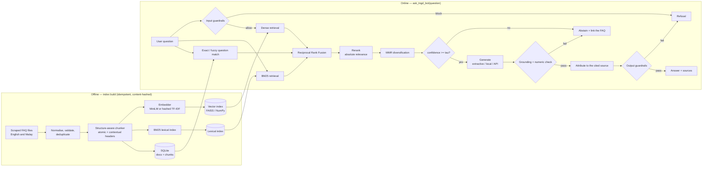

# Architecture

## Overview

Two phases: an offline index build, and an online question-answering path. They
share the analysis vocabulary (tokeniser, stopwords, aliases) — which is why a
change to it invalidates the persisted index via `Config.fingerprint()`.

## Module map

| Module | Responsibility |
| --- | --- |
| `config.py` | All tunables; env-var overrides; index fingerprint |
| `constants.py` | Endpoints, canned copy, on-disk index names |
| `deps.py` | Optional dependency probing (without importing) |
| `text.py` | Normalisation, tokenisation, sentence splitting, HTML→text |
| `models.py` | Shared dataclasses (`FaqDoc`, `Chunk`, `Candidate`, `Verdict`, …) |
| `resources/` | Packaged 30-entry seed knowledge base |
| `language.py` | Guesses Malay or English, so the question picks its knowledge base |
| `ingestion.py` | Load, coerce, validate, deduplicate |
| `chunking.py` | Structure-aware chunking ([docs](chunking.md)) |
| `embeddings.py` | Hashed TF-IDF and sentence-transformers backends |
| `indexes.py` | Vector index (FAISS/NumPy/pure) and Okapi BM25 |
| `store.py` | SQLite metadata store, thread-local connections |
| `reranking.py` | Absolute-relevance rerankers ([docs](retrieval.md)) |
| `retrieval.py` | Hybrid retrieval, RRF fusion, MMR |
| `guardrails/` | Input policy, injection defence, grounding, output policy ([docs](guardrails.md)) |
| `generation/` | Extractive, local seq2seq and API backends |
| `pipeline.py` | Orchestration, persistence, `ask_tngd_bot` |
| `scraper.py` | Zendesk Help Centre harvesting |
| `web/` | Stdlib chat UI |
| `evaluation.py`, `golden_set.py` | Metrics and regression gate ([docs](evaluation.md)) |
| `cli.py` | Subcommands |

## Design rules the code follows

**Fail closed.** Every uncertain path ends in abstention or refusal, never in a
guess. Low retrieval confidence, failed grounding, a fabricated number and a
failed output check all converge on the same safe response.

**Absolute scores.** Relevance is calibrated in `[0, 1]` and never normalised
across candidates, because a score that depends on its competitors cannot
support a threshold. This is what makes "I don't know" reachable.

**Separate trust domains.** User input is untrusted and screened hard. Retrieved
knowledge-base text is trusted and is never screened with input rules.

**Cite what you used.** Attribution follows the grounding citations, not the
retrieval ranking, so the URL shown always contains the sentence served.

**Lazy and optional.** No model is loaded, no package imported and no index
built until something needs it. Importing the package costs ~50 ms.

## Persistence

`.tngd_index/` holds `manifest.json`, `metadata.sqlite3`, `vectors.f32` +
`vectors.json`, and `lexical.json`. The manifest records the knowledge-base
hash, the config fingerprint, the embedder name and the package version; any
mismatch triggers a rebuild. The directory is disposable — `make index`
recreates it in about a second for the seed corpus and about three seconds for
the full 2,477-article FAQ.
